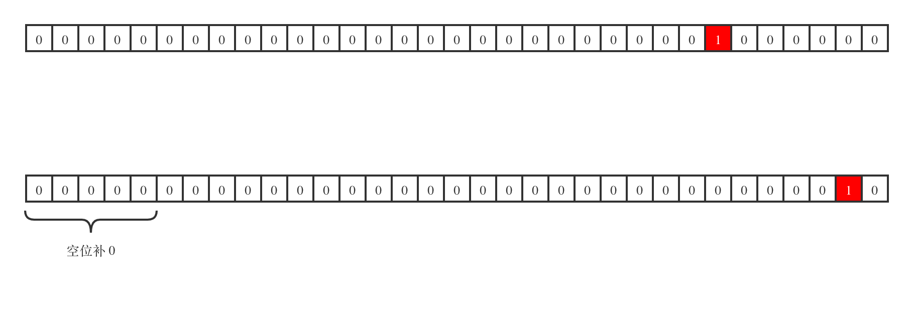

# _.slice

## 解析

```js
function slice(array, start, end) {
  // 保证不会取到空值的 length 属性
  let length = array == null ? 0 : array.length
  if (!length) {
    return []
  }
  start = start == null ? 0 : start
  end = end === undefined ? length : end

  // 保证传入的 start 与 end 不会超出数组边界
  //  _.slice([1, 2, 3], 0, -1) => [1, 2]
  if (start < 0) {
    start = -start > length ? 0 : (length + start)
  }
  end = end > length ? length : end
  if (end < 0) {
    end += length
  }
  // 这其中用到了无符号右移进行取整操作，下面会详细讲
  length = start > end ? 0 : ((end - start) >>> 0)
  start >>>= 0

  let index = -1
  const result = new Array(length)
  while (++index < length) {
    result[index] = array[index + start]
  }
  return result
}
```

关于下面这段代码大家在看到时候有可能会有些疑问：

```js
if (end < 0) {
  end += length
}
```

其操作应该是一个将 end 转为正数的过程，但是如果我们传入数组的长度为 2，end 为 -10，那么 -10 + 2 还是一个负数，其实下面还有一行代码处理了这个问题：

```js
length = start > end ? 0 : ((end - start) >>> 0)
```

如果用户的输入正确，那么在进行 `end += length` 操作之后，end 的值应该大于 start，否则输入错误。关于代码中用到的 `>>>` 操作符，请看下面的分析

### >>> 无符号右移

`>>>` 为无符号右移操作符，会将数值的所有 32 位都向右移。对于正数，有符号右移（>>）与无符号右移的结果相同。以 64 为例，64 向右移动 5 位，会变成 2：

```js
let oldValue = 64;
let newValue = oldValue >>> 5;
```

图示如下：



lodash 使用 `>>>` 目的是 **将可能存在的小数转为整数**：

```js
1.222 >>> 0 == 1
```

## 文档

```js
_.slice(array, [start=0], [end=array.length])
```

裁剪数组array，从 start 位置开始到end结束，但不包括 end 本身的位置。

Note: 这个方法用于代替 Array#slice 来确保数组正确返回。

### 添加版本

3.0.0

### 参数

array (Array): 要裁剪数组。
[start=0] (number): 开始位置。
[end=array.length] (number): 结束位置。

### 返回

(Array): 返回 数组array 裁剪部分的新数组。
